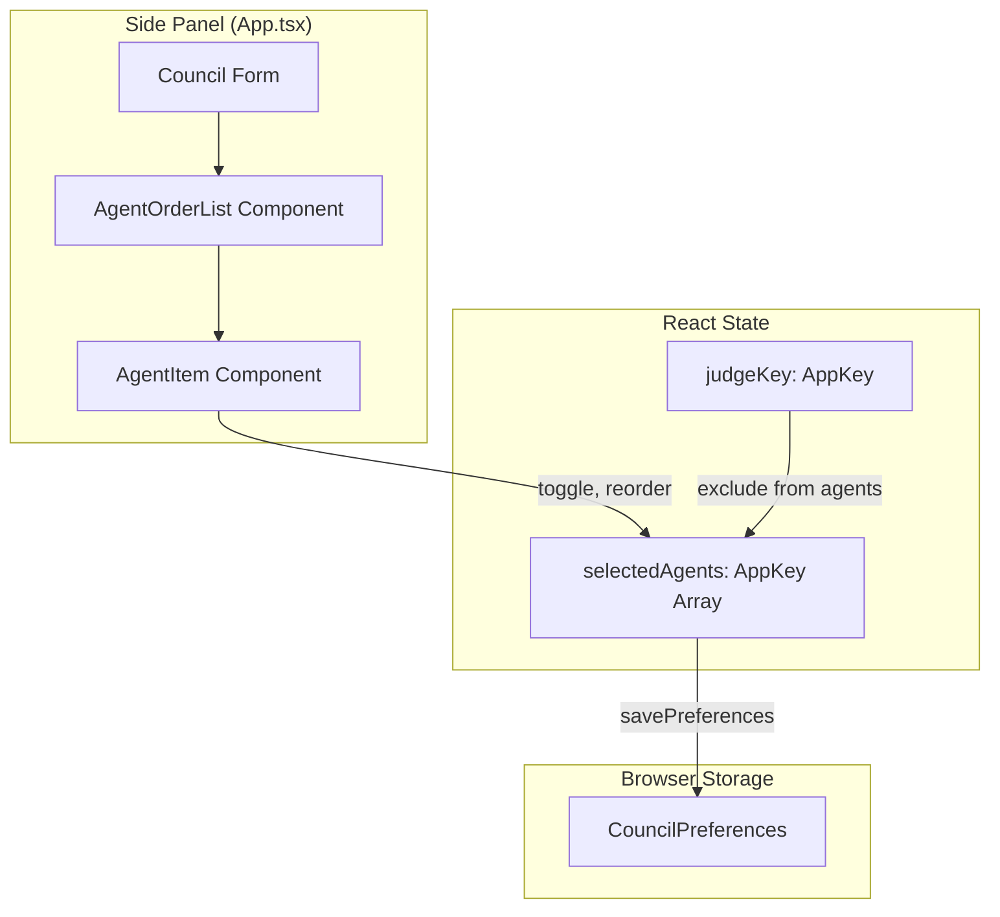
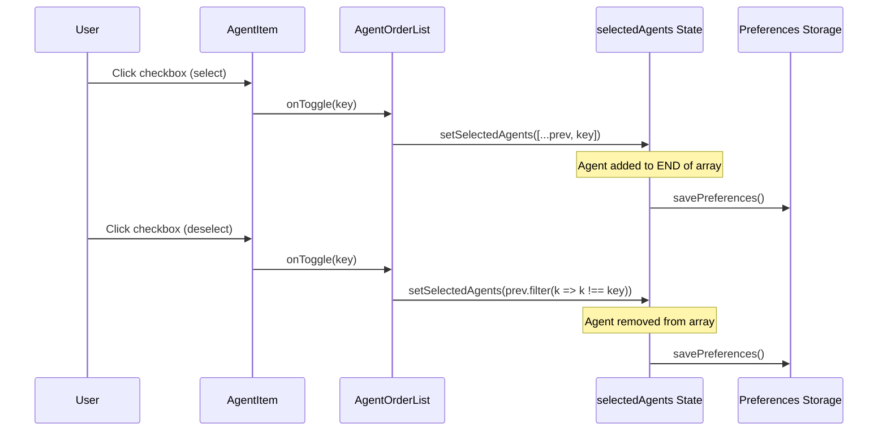
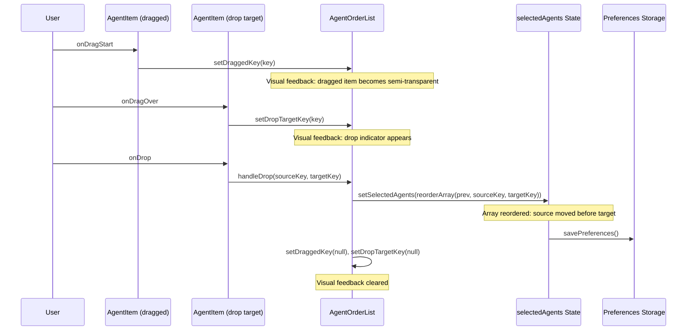
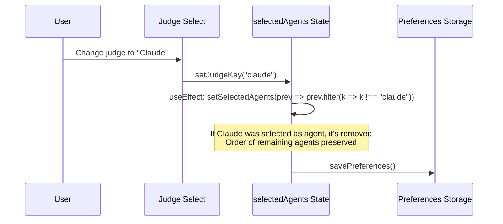

# Design Document: Agent Ordering UI

## Overview

This feature adds drag-and-drop ordering capability to the agent selection interface in the AI Council side panel. It transforms the current 2-column checkbox grid into an ordered list where users can rearrange selected agents via drag-and-drop. The order is stored in `CouncilPreferences.selectedAgentKeys` but is NOT used by the current Council execution workflow—it is being implemented now as a prerequisite for a future "Relay-Critique" workflow where agent execution order will matter.

The design preserves backward compatibility: existing Council mode behavior remains unchanged, and the order data is simply stored but ignored during execution.

## Architecture

The agent ordering UI is a pure frontend enhancement to the side panel's council form. No backend changes are required since the `selectedAgentKeys` array already preserves insertion order.



### Key Design Decisions

1. **No Drag-and-Drop Library**: React 19.2.7 has no DnD packages installed. We'll use the native HTML5 Drag and Drop API with pointer events for touch support.

2. **Order Storage**: The existing `selectedAgentKeys: AppKey[]` array naturally preserves order. No schema changes required.

3. **Backward Compatibility**: Council execution ignores order. The `RunCouncilRequest.agentKeys` order is preserved but execution behavior unchanged.

4. **Judge Exclusion**: When a judge is selected, it remains excluded from the agent list (current behavior maintained).

## Sequence Diagrams

### Agent Selection Flow (with ordering)



### Drag-and-Drop Reorder Flow



### Judge Change Flow (order preserved for remaining agents)



## Components and Interfaces

### Component: AgentOrderList

**Purpose**: Renders the ordered list of agents with drag-and-drop capability and manages drag state.

**Interface**:
```typescript
interface AgentOrderListProps {
  agents: SupportedAppWithRoles[];       // All available agents from appRegistry
  selectedKeys: AppKey[];                 // Ordered array of selected agent keys
  judgeKey: AppKey;                       // Current judge key (excluded from selection)
  onToggle: (key: AppKey) => void;        // Callback when agent checkbox toggled
  onReorder: (sourceKey: AppKey, targetKey: AppKey) => void;  // Callback when agent dragged to new position
}
```

**Responsibilities**:
- Render list of `AgentItem` components in `selectedKeys` order followed by unselected agents
- Manage drag-and-drop state (`draggedKey`, `dropTargetKey`)
- Provide drag event handlers to child `AgentItem` components
- Display visual drop indicators between items
- Handle keyboard reordering (accessibility)

### Component: AgentItem

**Purpose**: Renders a single agent row with checkbox, drag handle, and order badge.

**Interface**:
```typescript
interface AgentItemProps {
  agent: SupportedAppWithRoles;           // Agent metadata
  isSelected: boolean;                    // Whether agent is selected
  orderIndex: number | null;              // 1-based index if selected, null if unselected
  isJudge: boolean;                       // Whether this agent is the current judge
  isDragged: boolean;                     // Whether this item is currently being dragged
  isDropTarget: boolean;                  // Whether this item is the current drop target
  dragHandleProps: DragHandleProps;       // Props for drag handle (draggable, onDragStart, etc.)
  onToggle: () => void;                   // Callback when checkbox clicked
}

interface DragHandleProps {
  draggable: boolean;
  onDragStart: (e: React.DragEvent) => void;
  onDragEnd: (e: React.DragEvent) => void;
  onDragOver: (e: React.DragEvent) => void;
  onDrop: (e: React.DragEvent) => void;
}
```

**Responsibilities**:
- Render checkbox for selection toggle
- Render order badge (numbered circle) for selected agents
- Render drag handle (grip icon) with drag event handlers
- Apply visual states: disabled (judge), dragged (semi-transparent), drop target (highlighted)
- Handle keyboard interaction for accessibility

### Component: OrderBadge

**Purpose**: Displays a numbered badge indicating the agent's position in the order.

**Interface**:
```typescript
interface OrderBadgeProps {
  index: number;  // 1-based position
}
```

**Responsibilities**:
- Render a small circular badge with the position number
- Apply consistent styling with the app's design system

### Component: DragHandle

**Purpose**: Visual grip icon that serves as the draggable area.

**Interface**:
```typescript
interface DragHandleProps {
  disabled: boolean;
  onDragStart: (e: React.DragEvent) => void;
  onDragEnd: (e: React.DragEvent) => void;
  onDragOver: (e: React.DragEvent) => void;
  onDrop: (e: React.DragEvent) => void;
}
```

**Responsibilities**:
- Render a grip/hamburger icon (using Unicode or CSS)
- Serve as the drag source element
- Handle keyboard reorder shortcuts (Alt+Up/Down)

## Data Models

### CouncilPreferences (existing, no changes)

```typescript
interface CouncilPreferences {
  selectedAgentKeys: AppKey[];  // Already ordered array - no changes needed
  judgeKey: AppKey;
  parallelMode: boolean;
}
```

**Validation Rules**:
- `selectedAgentKeys` must not contain `judgeKey`
- All keys must be valid `AppKey` values
- Order is significant for future relay mode

### DragState (new internal state)

```typescript
interface DragState {
  draggedKey: AppKey | null;     // Key of item being dragged
  dropTargetKey: AppKey | null;  // Key of item being hovered over
}
```

**Validation Rules**:
- `draggedKey` must be a selected agent (not unselected, not judge)
- `dropTargetKey` must be a selected agent (not unselected, not judge)
- `draggedKey` and `dropTargetKey` must be different during active drag

### ReorderResult

```typescript
interface ReorderResult {
  success: boolean;
  newOrder: AppKey[];
  error?: string;
}
```

## Key Functions with Formal Specifications

### Function: toggleAgent()

```typescript
function toggleAgent(key: AppKey, selectedAgents: AppKey[], judgeKey: AppKey): AppKey[]
```

**Preconditions:**
- `key` is a valid `AppKey` value
- `selectedAgents` is an array of valid `AppKey` values
- `judgeKey` is a valid `AppKey` value
- `key` is not equal to `judgeKey` (enforced by UI, not this function)

**Postconditions:**
- If `key` was in `selectedAgents`: returns new array with `key` removed, order of remaining elements preserved
- If `key` was not in `selectedAgents`: returns new array with `key` appended to end
- Original `selectedAgents` array is not mutated
- All elements in returned array are unique (no duplicates)

**Loop Invariants:** N/A (no loops in this function)

```typescript
function toggleAgent(key: AppKey, selectedAgents: AppKey[], judgeKey: AppKey): AppKey[] {
  // Precondition: key is a valid AppKey (not validated here for performance)
  
  if (selectedAgents.includes(key)) {
    // Remove key, preserving order of remaining items
    return selectedAgents.filter(k => k !== key);
  } else {
    // Add key to end of array
    return [...selectedAgents, key];
  }
}
```

### Function: reorderAgents()

```typescript
function reorderAgents(selectedAgents: AppKey[], sourceKey: AppKey, targetKey: AppKey): AppKey[]
```

**Preconditions:**
- `selectedAgents` is an array of unique `AppKey` values
- `sourceKey` is an element of `selectedAgents`
- `targetKey` is an element of `selectedAgents`
- `sourceKey` is not equal to `targetKey`

**Postconditions:**
- Returns new array with same elements as `selectedAgents` but in different order
- `sourceKey` appears immediately before `targetKey` in the returned array
- Relative order of all other elements is preserved
- Original `selectedAgents` array is not mutated
- Returned array has same length as input array

**Loop Invariants:**
- During iteration: all processed elements remain in their original relative order
- During reconstruction: the position of `sourceKey` is tracked but not yet inserted

```typescript
function reorderAgents(selectedAgents: AppKey[], sourceKey: AppKey, targetKey: AppKey): AppKey[] {
  // Precondition: sourceKey and targetKey are in selectedAgents
  // Precondition: sourceKey !== targetKey
  
  if (sourceKey === targetKey) {
    return selectedAgents; // No-op
  }
  
  const result: AppKey[] = [];
  let sourceInserted = false;
  
  for (const key of selectedAgents) {
    if (key === sourceKey) {
      // Skip sourceKey - we'll insert it before targetKey
      continue;
    }
    
    if (key === targetKey && !sourceInserted) {
      // Insert sourceKey before targetKey
      result.push(sourceKey);
      sourceInserted = true;
    }
    
    result.push(key);
  }
  
  // Postcondition: result.length === selectedAgents.length
  // Postcondition: sourceKey appears before targetKey
  return result;
}
```

### Function: getAgentOrderIndex()

```typescript
function getAgentOrderIndex(key: AppKey, selectedAgents: AppKey[]): number | null
```

**Preconditions:**
- `key` is a valid `AppKey` value
- `selectedAgents` is an array of valid `AppKey` values

**Postconditions:**
- If `key` is in `selectedAgents`: returns 1-based index of `key` in the array
- If `key` is not in `selectedAgents`: returns `null`
- Original `selectedAgents` array is not mutated

**Loop Invariants:** N/A (uses `indexOf`)

```typescript
function getAgentOrderIndex(key: AppKey, selectedAgents: AppKey[]): number | null {
  const index = selectedAgents.indexOf(key);
  return index === -1 ? null : index + 1; // Convert to 1-based
}
```

### Function: validateReorder()

```typescript
function validateReorder(selectedAgents: AppKey[], sourceKey: AppKey, targetKey: AppKey): boolean
```

**Preconditions:**
- All parameters are defined (not null/undefined)

**Postconditions:**
- Returns `true` if and only if both `sourceKey` and `targetKey` are in `selectedAgents` and are different
- Returns `false` otherwise
- No mutations to input parameters

**Loop Invariants:** N/A (uses `includes`)

```typescript
function validateReorder(selectedAgents: AppKey[], sourceKey: AppKey, targetKey: AppKey): boolean {
  return (
    sourceKey !== targetKey &&
    selectedAgents.includes(sourceKey) &&
    selectedAgents.includes(targetKey)
  );
}
```

## Algorithmic Pseudocode

### Main Drag-and-Drop Reorder Algorithm

```pascal
ALGORITHM handleDrop(selectedAgents, sourceKey, targetKey)
INPUT: 
  selectedAgents: AppKey[] - current ordered selection
  sourceKey: AppKey - key of dragged item
  targetKey: AppKey - key of drop target
OUTPUT: newOrder: AppKey[] - reordered selection

BEGIN
  // Step 1: Validate the reorder operation
  ASSERT sourceKey ≠ targetKey
  ASSERT selectedAgents.includes(sourceKey) = true
  ASSERT selectedAgents.includes(targetKey) = true
  
  // Step 2: Build reordered array
  result ← empty array
  sourceInserted ← false
  
  FOR each key IN selectedAgents DO
    ASSERT result.length < selectedAgents.length
    
    IF key = sourceKey THEN
      // Skip source - will be inserted before target
      CONTINUE
    END IF
    
    IF key = targetKey AND NOT sourceInserted THEN
      // Insert source before target
      result.append(sourceKey)
      sourceInserted ← true
    END IF
    
    result.append(key)
  END FOR
  
  // Step 3: Verify result
  ASSERT result.length = selectedAgents.length
  ASSERT result.includes(sourceKey) = true
  ASSERT result.includes(targetKey) = true
  
  RETURN result
END
```

**Preconditions:**
- `sourceKey` and `targetKey` are both in `selectedAgents`
- `sourceKey` ≠ `targetKey`

**Postconditions:**
- `result` contains exactly the same elements as `selectedAgents`
- `sourceKey` appears immediately before `targetKey` in `result`
- All other elements maintain their relative order

**Loop Invariants:**
- At each iteration: `result` contains a subset of elements from `selectedAgents` in their original relative order
- `sourceInserted` is `true` if and only if `sourceKey` has been added to `result`

### Selection Toggle Algorithm

```pascal
ALGORITHM toggleAgent(key, selectedAgents)
INPUT:
  key: AppKey - agent key to toggle
  selectedAgents: AppKey[] - current ordered selection
OUTPUT: newSelection: AppKey[] - updated selection

BEGIN
  // Check if key is currently selected
  isCurrentlySelected ← false
  FOR each k IN selectedAgents DO
    IF k = key THEN
      isCurrentlySelected ← true
      BREAK
    END IF
  END FOR
  
  IF isCurrentlySelected THEN
    // Remove key, preserving order
    result ← empty array
    FOR each k IN selectedAgents DO
      IF k ≠ key THEN
        result.append(k)
      END IF
    END FOR
    RETURN result
  ELSE
    // Add key to end
    result ← copy of selectedAgents
    result.append(key)
    RETURN result
  END IF
END
```

**Preconditions:**
- `key` is a valid `AppKey`
- `selectedAgents` contains unique elements

**Postconditions:**
- If `key` was in input: `key` is not in output, all other elements present in same order
- If `key` was not in input: `key` is the last element, all other elements present in same order

**Loop Invariants:**
- During removal loop: processed elements maintain their relative order
- All elements in `result` are unique

### Judge Change Handler Algorithm

```pascal
ALGORITHM handleJudgeChange(newJudgeKey, selectedAgents)
INPUT:
  newJudgeKey: AppKey - newly selected judge
  selectedAgents: AppKey[] - current agent selection
OUTPUT: newSelection: AppKey[] - filtered selection

BEGIN
  // Remove judge from agents if present, preserving order
  result ← empty array
  
  FOR each key IN selectedAgents DO
    IF key ≠ newJudgeKey THEN
      result.append(key)
    END IF
  END FOR
  
  RETURN result
END
```

**Preconditions:**
- `newJudgeKey` is a valid `AppKey`
- `selectedAgents` contains unique elements

**Postconditions:**
- `newJudgeKey` is not in returned array
- All other elements from `selectedAgents` are present in same order
- Returned array length is either `selectedAgents.length` or `selectedAgents.length - 1`

**Loop Invariants:**
- All processed elements that are not `newJudgeKey` maintain their relative order

## Example Usage

### Basic Agent Selection and Reordering

```typescript
// Initial state: all agents selected in default order
const [selectedAgents, setSelectedAgents] = useState<AppKey[]>(() =>
  agentApps.map((a) => a.key)
);
// selectedAgents = ["chatgpt", "claude", "gemini", "deepseek", "qwen", "kimi"]

// User deselects "deepseek"
toggleAgent("deepseek", selectedAgents, judgeKey);
// Result: ["chatgpt", "claude", "gemini", "qwen", "kimi"]

// User reselects "deepseek"
toggleAgent("deepseek", selectedAgents, judgeKey);
// Result: ["chatgpt", "claude", "gemini", "qwen", "kimi", "deepseek"] - added to END

// User drags "deepseek" before "claude"
reorderAgents(selectedAgents, "deepseek", "claude");
// Result: ["chatgpt", "deepseek", "claude", "gemini", "qwen", "kimi"]

// User drags "chatgpt" before "qwen"
reorderAgents(selectedAgents, "chatgpt", "qwen");
// Result: ["deepseek", "claude", "gemini", "chatgpt", "qwen", "kimi"]
```

### Judge Change with Order Preservation

```typescript
// Current state
const selectedAgents = ["claude", "gemini", "qwen"];
const judgeKey = "chatgpt";

// User changes judge to "claude"
const newJudgeKey = "claude";
setJudgeKey(newJudgeKey);
// Effect: setSelectedAgents(prev => prev.filter(k => k !== newJudgeKey));
// Result: selectedAgents = ["gemini", "qwen"] - order preserved
```

### Drag-and-Drop Event Handling

```typescript
function AgentOrderList({ agents, selectedKeys, judgeKey, onToggle, onReorder }: AgentOrderListProps) {
  const [draggedKey, setDraggedKey] = useState<AppKey | null>(null);
  const [dropTargetKey, setDropTargetKey] = useState<AppKey | null>(null);
  
  const handleDragStart = (key: AppKey) => (e: React.DragEvent) => {
    setDraggedKey(key);
    e.dataTransfer.effectAllowed = "move";
    // Visual: set dragged item to semi-transparent
  };
  
  const handleDrop = (targetKey: AppKey) => (e: React.DragEvent) => {
    e.preventDefault();
    if (draggedKey && draggedKey !== targetKey) {
      onReorder(draggedKey, targetKey);
    }
    setDraggedKey(null);
    setDropTargetKey(null);
  };
  
  // ... render logic
}
```

## Correctness Properties


*A property is a characteristic or behavior that should hold true across all valid executions of a system-essentially, a formal statement about what the system should do. Properties serve as the bridge between human-readable specifications and machine-verifiable correctness guarantees.*


### Property 1: Selection Adds to End

*For any* current selection of agents and any unselected agent, selecting that agent shall append it to the end of the selection array.

**Validates: Requirements 1.2**

### Property 2: Removal Preserves Order

*For any* selection of agents and any agent within that selection, removing that agent shall preserve the relative order of all remaining agents.

**Validates: Requirements 1.3, 4.2**

### Property 3: Render Order Matches Selection Order

*For any* set of selected and unselected agents, the rendered list shall display all selected agents first in their stored order, followed by all unselected agents.

**Validates: Requirements 1.1**

### Property 4: Badge Shows Correct Position

*For any* selection of agents and any agent within that selection, the order badge shall display the agent's 1-based position in the selection array.

**Validates: Requirements 2.1, 2.3**

### Property 5: Reorder Places Source Before Target

*For any* selection containing both source and target agents where source ≠ target, after reordering, the source agent shall appear immediately before the target agent with all other agents maintaining their relative positions.

**Validates: Requirements 3.3**

### Property 6: Self-Drop is No-Op

*For any* selection of agents, attempting to reorder an agent onto itself shall result in no change to the selection.

**Validates: Requirements 6.3**

### Property 7: Judge Excluded from Selection

*For any* judge selection, the judge shall not appear in the rendered agent list.

**Validates: Requirements 4.1**

### Property 8: Disabled Drag for Non-Selected Agents

*For any* agent that is not selected (including the judge), the drag handle shall be disabled and shall not initiate a drag operation.

**Validates: Requirements 6.1, 6.2**

### Property 9: Keyboard Reorder Changes Position by One

*For any* selected agent not at a boundary position, Alt+Up shall decrease its position by 1 and Alt+Down shall increase its position by 1.

**Validates: Requirements 7.1, 7.2**

### Property 10: Toggle Round-Trip Preserves Order

*For any* selection of agents and any agent within that selection, removing and then re-adding that agent shall result in the agent appearing at the end while all other agents maintain their relative order.

**Validates: Requirements 1.2, 1.3**

### Property 11: Reorder Preserves Array Size and Elements

*For any* selection of agents and any valid reorder operation, the resulting array shall have the same length and contain exactly the same elements as the original array.

**Validates: Requirements 3.3**

## Error Handling

### Error Scenario 1: Invalid Drag Target

**Condition**: User attempts to drag an unselected agent or the judge
**Response**: Drag operation is blocked at the UI level (drag handle not interactive)
**Recovery**: No state change occurs; visual feedback indicates non-draggable item

### Error Scenario 2: Drop Outside Valid Area

**Condition**: User releases dragged item outside the list
**Response**: `onDragEnd` fires without `onDrop`; state resets
**Recovery**: List returns to original state; no reorder occurs

### Error Scenario 3: Concurrent State Modification

**Condition**: Judge changes while drag is in progress
**Response**: `useEffect` clears drag state when `judgeKey` changes
**Recovery**: Drag operation is cancelled; list re-renders with new judge exclusion

### Error Scenario 4: Empty Selection

**Condition**: All agents are deselected
**Response**: List shows all agents as unselected with checkboxes only (no order badges)
**Recovery**: User can reselect any agent; it appears at position 1

## Testing Strategy

### Unit Testing Approach

**Core Functions**:
- `toggleAgent()`: Test add, remove, edge cases (empty array, single element)
- `reorderAgents()`: Test all permutations of 3-element array, boundary cases
- `getAgentOrderIndex()`: Test selected/unselected/judge cases
- `validateReorder()`: Test valid/invalid combinations

**Test Coverage Goals**: 95% line coverage for utility functions

### Property-Based Testing Approach

**Property Test Library**: fast-check

**Properties to Test**:
1. **Order Preservation**: For any array S, any element k: after remove(k, S) and add(k, result), all other elements maintain relative order
2. **Reorder Consistency**: For any array S, any two distinct elements a, b: after reorder(S, a, b), a appears before b
3. **Idempotence**: toggle(toggle(k, S)) returns original array (if k ≠ judge)
4. **Inverse Operations**: remove(a, reorder(S, a, b)) = remove(a, S)

### Integration Testing Approach

**Component Integration**:
- `AgentOrderList` renders correctly with selected/unselected mix
- Drag-and-drop updates state correctly
- Judge change clears drag state
- Preferences save after each operation

**Manual Testing Checklist**:
- [ ] Select agent: appears at end of list with correct badge
- [ ] Deselect agent: removed from list, badges update
- [ ] Drag agent: visual feedback correct, drop works
- [ ] Change judge: removed from agents if selected, order preserved
- [ ] Refresh panel: order restored from preferences
- [ ] Keyboard navigation: Tab through agents, Alt+Up/Down to reorder

## Performance Considerations

### Render Performance

- **List Size**: Typically 6-8 agents; no virtualization needed
- **Re-renders**: Minimized by using `useCallback` for event handlers
- **Drag Feedback**: CSS transitions for smooth visual updates

### Storage Performance

- **Save Frequency**: Debounced to avoid excessive writes on rapid changes
- **Array Size**: Small (6-8 elements); serialization is trivial

### Drag Performance

- **Native DnD API**: No library overhead; browser-optimized
- **Touch Support**: Pointer events provide unified handling
- **No Animation Frame**: Simple state updates, no heavy computation during drag

## Security Considerations

### Input Validation

- **AppKey Validation**: All keys come from enum; no user input
- **Array Bounds**: No out-of-bounds access possible with filter/map operations

### Data Integrity

- **Preferences Storage**: Same origin; Chrome storage API provides isolation
- **No External Data**: Agent list is hardcoded; no network requests

### No New Attack Vectors

- Drag-and-drop is purely client-side
- No cross-origin communication
- No eval or dynamic code execution

## Dependencies

### Existing Dependencies (No Additions Required)

| Package | Version | Purpose |
|---------|---------|---------|
| react | ^19.2.7 | UI framework |
| react-dom | ^19.2.7 | DOM rendering |
| wxt | ^0.20.27 | Extension framework |
| typescript | ^6.0.3 | Type safety |

### No New Dependencies

The HTML5 Drag and Drop API is native to browsers and requires no additional packages. This keeps the bundle size minimal and avoids supply chain risks.

### Browser Compatibility

- **HTML5 DnD**: Supported in Chrome 4+ (extension target)
- **Pointer Events**: Supported in Chrome 55+ (for touch/future-proofing)
- **CSS Grid**: Supported in Chrome 57+ (existing layout)

## Migration Path

### Phase 1: UI Change Only (This Feature)

1. Replace `agent-grid` with `AgentOrderList` component
2. Add drag-and-drop handlers
3. Add CSS styles for order badges and drag feedback
4. No changes to backend or execution logic

### Phase 2: Relay Mode (Future Feature)

1. Add `executionMode: "council" | "relay"` to preferences
2. When `relay` mode active, use `selectedAgentKeys` order for sequential execution
3. Keep `council` mode behavior unchanged (ignore order)
4. Add UI toggle for mode selection

### Backward Compatibility

- Existing preferences (unordered selection) work immediately
- First selection sets initial order
- No migration script needed; array order is preserved automatically
